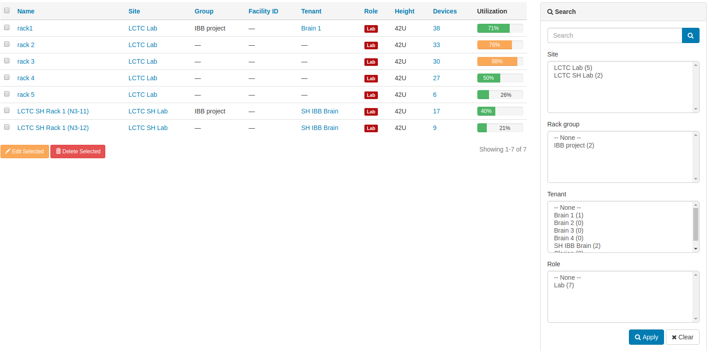
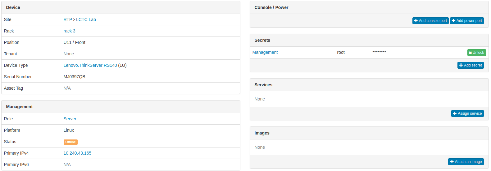

<section class="row">
  

    <h1>
      Datacenter Infrastructure Management
      <i class="fa fa-cubes">
      Netbox **revised**
      </i>
    </h1>
  

  

    

      **Audience:** 

      - General
    

    

      **Prepared by:** 

      - Feng Xia ([fengxia41103@gmail.com](mailto:fengxia41103@gmail.com)) 
    

    

      **Last updated on:** 

      - 08/2018
    

    

      **Also available:**
      <a href="netbox.pdf">PDF</a>
    

  

</section>
---
<h6 class="menu-title">Table of contents</h6>

1. Problems to solve
1. Demo
1. Dashboard
2. Rack
3. Device
  1. Device type
  2. Device role
  1. Interfaces
  2. Bay device
  3. Inventory items
  4. Remote management
  5. Cable connections
4. Logical grouping

---
<h6>Problems to solve</h6>

Datacenter devop headaches:

1. I'm using Excel to track hardware inventory and networks, but it
has too many conflicting errors now to be useful anymore.

**Diagnosis**: Only having a data model built with accurate domain
knowledge of data center components and operation, can one be sure
erroneous inputs stand no chance to pollute your data.

2. Logging server information such as UUID is tedious and error
prone. But without being fully accurate, these information have
little value as reference.

**Diagnosis**: If these information can be collected from device
directly, machine can do it better than human operator.

3. There is a jungle of cables on the back of my rack. Detecting
a loose connection or a cable plugged into a wrong port is nearly
impossible.

**Diagnosis**: Visualizing physical connection was limited to you
looking at the cable jungle. Not anymore. Smart tool can figure
this out by tracing MAC through the entire infrastructure.

4. I need to run sever and network report by geo location, by tenants,
and by networks. But creating them is time consuming.

**Diagnosis**: There are unlimited ways to view and aggregate your
infrastructure components. Netbox created a cohesive data model
that can be reported and aggregated. Let the computer to compile
that report for you.

---
<h6>Demo</h6>

<video width="100%" height="100%" controls="controls">
  <source src="images/netbox.mp4 " type="video/mp4" />
  Your browser does not support the video tag.
  /* instead of the last line you could also add the flash player*/
</video>

---
<h6>Dashboard</h6>

  

    
  

  

    <ol>
      <li>Covers all data points a datacenter management needs.</li>
      <li>At glance of all inventory and their use.</li>
      <li>Initiate a drill down from any view point.</li>
      <li>Inter-linked data model guarantees information consistency.</li>
    </ol>
  

---

<h6>Rack</h6>

1. Multiple filters
2. Utilization

---

<h6>Rack: **Device layout**</h6>

  

    
  

  

    <ol>
      <li>Front & Rear view handles half-depth device and different
      mount orientation.</li> 
      <li>View access information, eg. server's IP address.</li>
      <li>Can make reservation, thus allowing infrastructure planning ahead of time.</li>
      <li>Color code to group device by its purpose.</li>
      <li>Flag if device is not accessible (in black) &larr; powered
        off, or credential needs an update. In both cases, it highlights
        a need of admin attention.</li>
    </ol>
  

---
<h6>Rack: **Device list**</h6>

1. Easy to sort by any header.
2. Can be exported as report.
3. All associated data is a link.

---
<h6>Device</h6>

1. The center piece of Netbox models is the Device, representing a
physical device such as server and switch. This makes sense as the
primary physical asset of a data center are certainly these devices.
2. Device can be assigned `role` and a `type`.

---

<h6>Device: **Type**</h6>

1. Inventory manufacturer, part number, and such.
2. Setup **rules** to allows network interface (is `Network Device`), console port, etc..

---

<h6>Device: **Role**</h6>

1. Flexible for your environment to logically group and manage devices.
2. Color code.

---
<h6>Device: **Interface**</h6>

1. Best way to manage dynamic list such as interface list through **automation**.
2. Diagnose network issue by seeing exactly which inteface serves the IP you know.
3. The **only tool on the market to show cable connections**. In the
   example above, it shows a switch port `1` is connected to port `XGE4`
   of another switch with IP `10.240.43.28` and is on in slot 39 on
   rack 4.

---

<h6>Device: **Inventory item**</h6>

1. Build inventory of sub-components inside a server.
2. Never again to type in **serial number** of a device by hand.
3. View its configuration and state.

---

<h6>Device: **Remote management**</h6>

  

    
  

  

    
  

1. Power cycle server and choose a `boot mode`, eg. UEFI, PXE.
2. Manage switch config at **port level**.

---

<h6>Device: **Networking cable connections**</h6>

  

    
  

  

    <ol>
      <li>**Unique feature in the market**.</li>
      <li>Visualize networking cable connections including
      **inter-switch** and **server-switch** down to the switch port
      level.</li>
      <li>Easy to drill down by simply clicking on `port` and `interface`.</li>
    </ol>
  

---

<h6>Logical grouping</h6>

1. Map infrastructure  to your business hierarchy.
2. Data model supports flexible many ways of reporting and information aggregation.
  1. By `region`,`site` and `tenant`.
  2. By `device type`, `device role`, `platform`.
  3. By `rack group`, `tenant group`.
  4. By `cluster`
  5. Ultimately, **by any device attribute**.

---

<h6>THE END</h6>

