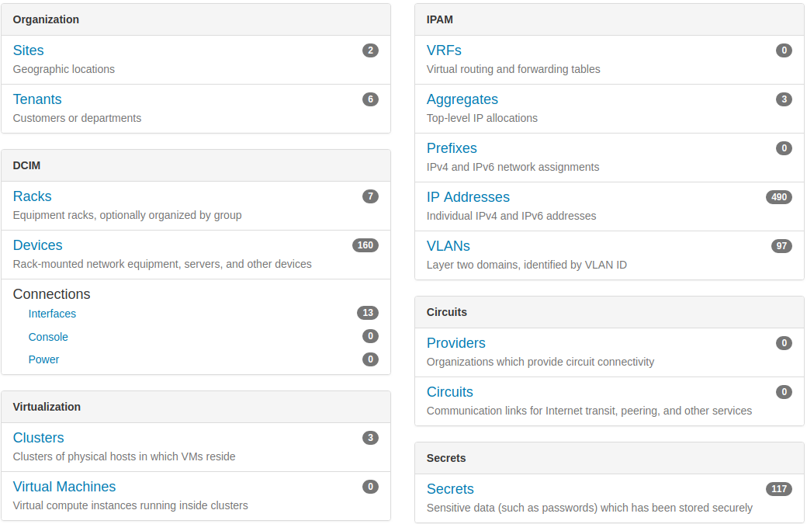

<section class="row">
  

    <h1>
      Datacenter Infrastructure Management
      <i class="fa fa-cubes">
      Netbox **revised**
      </i>
    </h1>
  

  

    

      **Audience:** 

      - General
    

    

      **Prepared by:** 

      - Feng Xia ([fengxia41103@gmail.com](mailto:fengxia41103@gmail.com)) 
    

    

      **Last updated on:** 

      - 08/2018
    

  

</section>
---
<h6 class="menu-title">Table of contents</h6>

1. Problems to solve
1. Dashboard
2. Rack
3. Device
  1. Interfaces
  2. Bay device
  3. Inventory items
  4. Remote management
  5. Cable connections
4. Logical grouping
  1. by geographical locations
  2. by tenants
  3. by clusters

---
<h6>Problems to solve</h6>

Datacenter devop headaches:

1. I'm using Excel to track hardware inventory and networks, but it
has too many conflicting errors now to be useful anymore.

**Diagnosis**: Only having a data model built with accurate domain
knowledge of data center components and operation, can one be sure
erroneous inputs stand no chance to pollute your data.

2. Logging server information such as UUID is tedious and error
prone. But without being fully accurate, these information have
little value as reference.

**Diagnosis**: If these information can be collected from device
directly, machine can do it better than human operator.

3. There is a jungle of cables on the back of my rack. Detecting
a loose connection or a cable plugged into a wrong port is nearly
impossible.

**Diagnosis**: Visualizing physical connection was limited to you
looking at the cable jungle. Not anymore. Smart tool can figure
this out by tracing MAC through the entire infrastructure.

4. I need to run sever and network report by geo location, by tenants,
and by networks. But creating them is time consuming.

**Diagnosis**: There are unlimited ways to view and aggregate your
infrastructure components. Netbox created a cohesive data model
that can be reported and aggregated. Let the computer to compile
that report for you.

---
<h6>Dashboard</h6>

  

    
  

  

    <ol>
      <li>Covers all data points a datacenter management needs.</li>
      <li>At glance of all inventory and their use.</li>
      <li>Initiate a drill down from any view point.</li>
      <li>Inter-linked data model guarantees information consistency.</li>
    </ol>
  

---

<h6>Rack</h6>

1. Multiple filters
2. Utilization

---

<h6>Rack: **Device layout**</h6>

  

    
  

  

    <ol>
      <li>Front & Rear view handles half-depth device and different
      mount orientation.</li> 
      <li>View access information, eg. server's IP address.</li>
      <li>Can make reservation, thus allowing infrastructure planning ahead of time.</li>
      <li>Color code to group device by its purpose.</li>
      <li>Flag if device is not accessible (in black) &larr; powered
        off, or credential needs an update. In both cases, it highlights
        a need of admin attention.</li>
    </ol>
  

---
<h6>Rack: **Device list**</h6>

1. Easy to sort by any header.
2. Can be exported as report.
3. All associated data is a link.

---
<h6>Device</h6>

---
<h6>Device: **Interface**</h6>

---

<h6>Device: **Bay device**</h6>

---

<h6>Device: **Inventory item**</h6>

---

<h6>Device: **Remote management**</h6>

---

<h6>Device: **Cable connections**</h6>

---

<h6>Logical Grouping</h6>

---

<h6>Logical grouping: **by geographical location**</h6>

---

<h6>Logical grouping: **by tenants**</h6>

---

<h6>Logical grouping: **by clusters**</h6>
